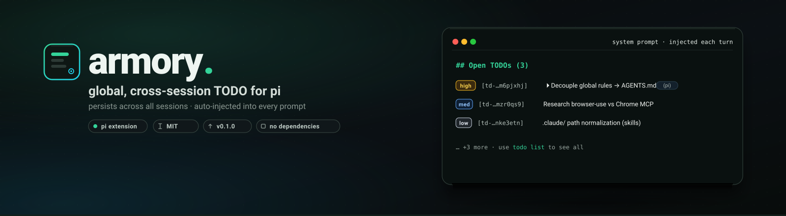

<p align="center">
  
</p>

<h1 align="center">armory-todo</h1>

<p align="center">
  A TODO list that <strong>survives across all your pi sessions</strong> — not just within one.
</p>

<p align="center">
  <a href="https://www.npmjs.com/package/@getpipher/armory-todo"></a>
  
  
  
</p>

<p align="center">
  <strong>lifecycle boxes</strong> · <strong>title + notes</strong> · <strong>auto-prune</strong> · <strong>source-aware reap safety</strong> · <strong>interactive panel</strong> · <strong>health diagnostics</strong> · <strong>hard-prune gate</strong>
</p>

---

## Public API

The package `exports` entry (`./src/index.ts`) is the **stable public surface** —
`addTodo`, `listTodos`, `updateTodo`, `getTodo`, `completeTodo`, `parkTodo`,
`deleteTodo`, `loadStore`, `saveStore`, and the `Todo` / `AddInput` /
`UpdateInput` / `ListFilter` / `Priority` / `Status` / `Store` /
`SaveStoreOptions` types (plus `TodoError`). Other `src/*` paths
are internal and may change without notice. Depend on `@getpipher/armory-todo`
(the public entry), never deep-import `src/*`.

---

## The problem

pi sessions are ephemeral conversation branches. A TODO you tell to session A is invisible to session B unless you manually write it to a notes file *and* remember to read it next time. Every existing pi todo extension (`@juicesharp/rpiv-todo`, `@xynogen/pix-todo`, `@gonrocca/zero-pi-todo`, …) is **conversation-branch-scoped** — they persist via pi's `appendEntry()` and survive compaction + `/reload` *within a single session*. None bridge across separate sessions, and none make a fresh session aware of pending work on its own.

`armory-todo` is the other shape: a single disk file that **every** session reads, plus an **auto-injected** `## Open TODOs` block in the system prompt so a fresh session starts already aware.

| | survives compaction/reload *within* a session | survives across *separate* sessions | auto-surfaced in every new session |
|---|:---:|:---:|:---:|
| branch-scoped todo extensions | ✅ | ❌ | ❌ |
| **armory-todo** | ✅ | ✅ | ✅ |

## Install

```bash
pi install git:github.com/getpipher/armory-todo      # from git
pi install npm:@getpipher/armory-todo                 # from npm (scoped)
```

Then restart pi (or `/reload`). Or add to `~/.pi/agent/settings.json`:

```json
{ "packages": ["npm:@getpipher/armory-todo"] }
```

## Lifecycle boxes (v0.2.0)

TODOs live in one of three states, only one of which hits the agent context:

| Box | Status(es) | Auto-injected? | Recoverable? |
|---|---|:---:|:---:|
| **Active** | `open`, `in_progress` | ✅ Yes (capped 15) | n/a |
| **Parked** | `parked` | ❌ No | ✅ `update --status open` |
| **Archive** | `done`, `cancelled` | ❌ No | ✅ `restore <id>` |

**Pruning:** `prune` (default: done/cancelled older than 7 days) moves finished
todos from the live file to `todo-archive.json` — nothing is deleted. `prune --all`
ignores age. `restore <id>` brings an archived todo back as `open`.

**Auto-prune (v0.3.1):** on every `session_start`, done/cancelled todos older
than `config.prune.defaultAgeDays` (default 7d) archive *themselves* — no need
to run `prune` manually. Fresh done (<7d) stays in live. The startup notify
reports what moved (`auto-pruned N stale done (>7d): …` + a `restore` hint);
it's a transient message, not a prompt injection. Reversible via `restore <id>`.
`prune --all` (move fresh done too) and `prune --hard` (irreversible) stay manual.

**Source-aware stale-active reap (v0.6.0):** producers can leave tracked todos
`open`/`in_progress` forever when a worker dies before reporting a terminal
status. On `session_start`, armory-todo now self-heals configured producer
sources: stale `armory-fleet` todos (default: untouched for 2d) become
`cancelled` and move directly to the archive, where `restore <id>` works
immediately. Real/manual todos are never auto-mutated; non-policy active todos
untouched for 14d get an advisory `ORPHAN` health flag and ⌛ panel marker.
Both thresholds are editable in the Config tab. Expected live→archive drops
keep rolling backup, drop-snapshot, and audit protection without emitting a
false wipe alert.

The only irreversible action is `prune --hard` (hard-prune) — it requires an
explicit `confirm: true` and is always user-confirmed. See **Self-awareness**
below.

**Storage layout:**

```
~/.pi/agent/todo/
  todo.json              # active + parked
  todo-archive.json      # done + cancelled (sealed history)
  todo.config.json       # prune/health/reap thresholds + notify settings
```

A v1 single-file store at `~/.pi/agent/todo.json` is migrated automatically on
first load after upgrade.

## Self-awareness: health + hard-prune

**`health`** reports bloat across all three boxes — counts, stale items, and
actionable suggestions (e.g. "archive: 41 items older than 180d → consider
`prune --hard --box archive --older-than 180 --confirm`"). On `session_start`,
if any bloat flags are detected, the startup notify appends a `⚠ N bloat
signals` nudge.

**`prune --hard`** is the **only irreversible action** — it permanently deletes
todos. It's gated three ways:
1. **Tool-level:** `confirm: true` is required in the tool call; without it the
   action refuses with a clear message.
2. **Prompt-level:** the agent is instructed to always run `health` first,
   surface the report + the exact proposed command, and wait for an explicit
   user "yes" before passing `confirm: true`.
3. **Slash-level:** `/todo prune --hard` prompts an interactive `ctx.ui.confirm`
   yes/no dialog before executing.

Everything else in armory-todo is reversible. `prune --hard` is the one
irreversible escape hatch, always user-confirmed.

## Project-scope management (v0.4.0)

A project registry (`~/.pi/agent/todo/projects.json`, lazy-synced on read) tracks known projects + an advisory per-project **`maxOpen`** cap slot. The `todo` tool gains two actions: **`projects`** (per-project scope overview — open/in_progress/parked/done counts + `maxOpen` + `OVER`/`?typo` markers + last-updated) and **`project_rename`** (rename or merge a project; rewrites live + archive + registry — the typo-cleanup path, e.g. `foo-bat` → `foo-bar`).

`health` gains four per-project flags: **`PROJECT_OVER`** (open > a project's `maxOpen` slot), **`PROJECT_LARGE`** (open > `health.perProjectDefaultMax`, default 8 — fires out-of-the-box, no per-project config needed), **`PROJECT_STALE`** (project untouched > `activeStaleDays`), **`PROJECT_TYPO`** (1-todo project with a near-named sibling, Levenshtein ≤ 2). The `/todo health` report + the `todo` `health` action both show a `projects:` section.

The interactive `/todo` panel gains a 6th tab — **Projects** — listing the overview rows + a `(no project)` summary, with an action submenu per project: **Rename / merge** (inline input), **Set maxOpen** (number or `clear`), **Filter active to project** (jump to the Active tab scoped). A thin `/todo projects` slash mirrors the overview as text.

**Advisory in v0.4.0 → enforced in v0.5.0** — `maxOpen` now blocks `add` (and project-move) when a project is at its cap. See the [Caps enforcement (v0.5.0)](#caps-enforcement-v050) section below.

## Caps enforcement (v0.5.0)

Three caps keep the store (and its auto-injected prompt block) from bloating silently — the forcing-function half of [issue #1](https://github.com/getpipher/armory-todo/issues/1):

1. **Count cap (per-project `maxOpen`, enforced).** A project's `maxOpen` slot (set via the Projects tab → Set maxOpen, or `setProjectMaxOpen`) **blocks `add`** when the project is at its cap, and **blocks a project-move** of an `open`/`in_progress` todo into a capped project. The cap is on the `open` count (matches the `PROJECT_OVER` health flag); `in_progress` doesn't count. Un-park (`parked→open`) is intentionally **not** blocked — reactivating deferred work isn't adding new work. The block message tells you how to raise/clear the cap. `maxOpen: null` (default) = uncapped.

2. **Notes cap (`health.maxNotesBytes`, default 8192 bytes, enforced).** Oversize notes are rejected at `add`/`update` (only when `notes` is being written — a title edit on a grandfathered oversize note isn't trapped). Byte-length, not char-length (notes can hold Unicode). Existing oversize notes are grandfathered; `health` surfaces the worst offender via the `NOTES_OVER` flag + an actionable `todo update <id> notes:…` suggestion.

3. **Over-cap injection truncation.** When actionable > `health.activeMaxOpen` (default 15), the auto-injected `## Open TODOs (N)` block collapses to a ~4-line summary (total + project span + over-budget projects + a `todo list` pointer) instead of the row list. Under the cap → the familiar row list. `activeMaxOpen` itself stays **advisory** (it drives the `ACTIVE_LARGE` flag and the truncation trigger; it is not a hard global block).

**Backwards-compat:** zero migration (store v3, config v1, registry v1 unchanged in shape). Oversize notes grandfathered. The `maxOpen` advisory→enforced graduation is a documented behavior change for any v0.4.0 user who set a slot (the block message tells them how to raise/clear).

## Interactive panel (SPEC-3)

Run `/todo` (no arg) in a TUI session to open the interactive triage panel:

- **Box tabs** (Tab / Shift+Tab): Active · Parked · **Done** · Archive · **Projects** · Config
- **Filter input**: type to search by text (live filter)
- **SelectList**: arrow keys navigate, Enter selects
- **Action submenu** (on Enter): View detail / Complete / Park / Re-activate / Restore / Edit title / Delete
- **Done tab** (v0.3.1): all finished work (`status: done`) unified across live + archive, location-tagged (`[live Nd]` / `[archived YYYY-MM-DD]`), filterable; Enter → View detail, or Restore-from-archive. Excludes `cancelled` (that's in the Archive tab).
- **Detail view** (View detail, or Enter on a row): renders the title + full `notes` read-only, with a footer hint on editing notes via the `todo` tool
- **Archive box**: summary-first (counts by project + month) → Enter on a bucket to drill down
- **Projects tab** (v0.4.0): per-project scope overview (open/in_progress/parked/done counts + `maxOpen` + `OVER`/`?typo` markers) + a `(no project)` summary row; Enter on a project → action submenu: Rename / merge · Set maxOpen · Filter active to project.
- **Config box**: SettingsList with prune ages + health thresholds — edit live, persists to `todo.config.json`
- **Escape**: exit the panel

Typed subcommands (`/todo park <id>`, `/todo prune`, etc.) all still work alongside the panel. Non-TUI sessions (`pi -p`, RPC) fall back to the text list.

## Usage

**Say it naturally** — the model calls the `todo` tool:

> “put this in our TODO: decouple global rules into AGENTS.md”
> “show me the TODO” → “mark td-… done”
> “park td-… for now” → later: “restore td-…”
> “prune the done todos”

**Slash command** for quick human triage:

```
/todo                    list open + in-progress TODOs
/todo all                include parked/done/cancelled
/todo add <title>        quick add (priority: med; notes via the todo tool)
/todo finished          list all done todos (live + archived, recent first)
/todo done <id>          mark done
/todo rm <id>            cancel (tombstone)
/todo park <id>          defer (parked — not injected, recoverable)
/todo restore <id>       bring an archived todo back as open
/todo prune [--all]      move done/cancelled to archive (reversible)
/todo prune --hard        permanent deletion (interactive confirm prompt)
/todo archive [filter]   archive summary, or filtered slice (project:X / text:Y)
/todo health              bloat report across all boxes + flags + suggestions
/todo clean              clear all done (deprecated — use prune)
/todo path               show the store file path
```

**The `todo` tool** (model-callable):

| action | params | effect |
|---|---|---|
| `list` | `statusFilter?`, `projectFilter?`, `tagFilter?`, `text?`, `since?`, `before?`, `limit?`, `page?`, `archived?` | matching TODOs (default: open + in_progress). `archived:true` queries the archive — bare call returns a summary, filters return paginated slices |
| `add` | `title`, `notes?`, `project?`, `tags?`, `priority?`, `source?` | create a TODO (`title` ≤120 chars; long detail goes in `notes`) |
| `get` | `id` | read a TODO's full record incl. `notes` |
| `update` | `id`, `title?`, `notes?`, `priority?`, `status?`, `project?`, `tags?` | edit a TODO (set `status: parked` to defer; `notes=""` clears) |
| `complete` | `id` | mark done |
| `delete` | `id` | cancel (tombstone) |
| `park` | `id` | defer (parked — not injected) |
| `prune` | `ageDays?`, `all?` | move done/cancelled to archive (reversible via restore) |
| `restore` | `id` | bring an archived TODO back as open |
| `health` | (none) | bloat report across active/parked/archive + flags + suggestions |
| `prune` (hard) | `hard:true`, `confirm:true`, `box?`, `olderThan?`, `project?`, `tag?` | PERMANENT deletion — the only irreversible action |
| `clear` | `status?` (default `done`) | bulk-clear a status (deprecated — use prune) |

Each TODO carries `id, title (≤120 chars), notes (any length), project, tags, priority (low|med|high|critical), status (open|in_progress|parked|done|cancelled), source, createdAt, updatedAt, closedAt`. The auto-injected block + list/panel show `title` only; `notes` is read via `get` and never injected.

## How it works

- **Disk store** — `~/.pi/agent/todo/` folder: `todo.json` (live: active + parked), `todo-archive.json` (sealed: done + cancelled), `todo.config.json` (prune ages + health thresholds), `projects.json` (project registry: canonical names + advisory `maxOpen` slots, v0.4.0). Atomic `0600` writes, corrupt-file auto-recovery, `version: 3` store schema (`title` ≤120 chars + `notes` any length; v2 `text`-only stores migrate to v3 on first load). Not pi session entries, so it outlives any conversation.
- **`todo` tool** — model CRUD + lifecycle (above).
- **`/todo` command** — human triage (above).
- **Auto-inject** — on every `before_agent_start`, a compact `## Open TODOs (N)` block (titles + ids, sorted by priority) is appended to the system prompt, so the agent starts every turn already aware of pending work. The block is **cap-aware** (v0.5.0): under `health.activeMaxOpen` (default 15) it lists the rows; **over** the cap it collapses to a lean summary (counts + over-budget projects + a `todo list` pointer) so the prompt stays bounded when the store bloats. Only `open` + `in_progress` are injected — `parked` and archived todos are excluded (the lifecycle-box boundary). Mutations refresh it on the next turn.
- **Source-aware safety protocol** — on `session_start`, policy-source stale actives (default `armory-fleet` >2d) move live→archive as immediately-restorable `cancelled` records. Non-policy stale actives are flagged only; never mutated. The Archive tab reports the cumulative number of auto-reaped runs.
- **Archive query** — `list` with `archived:true` is summary-first (counts by project + month) then filtered/paginated on demand, so a large archive never bloats a single query.

Full design + decisions:
- v0.6.0 (source-aware reap safety protocol): [`docs/superpowers/specs/2026-07-29-reap-safety-protocol-design.md`](docs/superpowers/specs/2026-07-29-reap-safety-protocol-design.md)
- v0.4.0 (project-scope management): [`docs/superpowers/specs/2026-07-21-project-scope-management-design.md`](docs/superpowers/specs/2026-07-21-project-scope-management-design.md)
- v0.3.1 (auto-prune + unified Done view): [`docs/superpowers/specs/2026-07-21-auto-prune-done-view-design.md`](docs/superpowers/specs/2026-07-21-auto-prune-done-view-design.md)
- v0.3.0 (title + notes split): [`docs/superpowers/specs/2026-07-21-title-notes-split-design.md`](docs/superpowers/specs/2026-07-21-title-notes-split-design.md)
- v0.2.0 (lifecycle boxes + prune + health): [`docs/superpowers/specs/2026-07-20-lifecycle-boxes-prune-design.md`](docs/superpowers/specs/2026-07-20-lifecycle-boxes-prune-design.md)
- Original v0.1.0 spec: [`docs/todo-SPEC.md`](docs/todo-SPEC.md)

## Configuration

| env var | default | purpose |
|---|---|---|
| `TODO_DIR` | `~/.pi/agent/todo/` | override the store folder (tests / multiple profiles) |

`todo.config.json` (in `TODO_DIR`) holds prune ages, health thresholds, and notify toggles. All values are optional — missing fields are merged with defaults on load.

```jsonc
{
  "version": 1,
  "prune":  { "defaultAgeDays": 7, "hardAgeDays": 180, "statuses": ["done", "cancelled"] },
  "health": { "activeMaxOpen": 15, "activeStaleDays": 30, "parkedMax": 10,
              "parkedStaleDays": 60, "archiveMax": 200, "archiveOldDays": 180,
              "perProjectDefaultMax": 8, "maxNotesBytes": 8192 },
  "notify": { "sessionStartCount": true },
  "reap": {
    "orphanFlagAfterDays": 14,
    "policy": { "armory-fleet": { "reapAfterDays": 2, "reapTo": "cancelled" } }
  }
}
```

| `notify.*` | default | purpose |
|---|---|---|
| `sessionStartCount` | `true` | Show the `armory-todo: N open TODOs` startup line. Set `false` to silence it — safety messages (wipe recovery, auto-prune, reap) still surface. |

| `reap.*` | default | purpose |
|---|---:|---|
| `orphanFlagAfterDays` | `14` | Advisory ORPHAN threshold for active todos whose source is not auto-reaped; never mutates them. |
| `policy.armory-fleet.reapAfterDays` | `2` | Move stale fleet-tracked active todos directly to archive as cancelled. |
| `policy.armory-fleet.reapTo` | `cancelled` | Fixed reversible terminal status; `done` is intentionally unsupported. |

Run the store tests: `npm test` (497/497 across 15 suites).

## Known issues

- **No in-panel multi-line `notes` editing.** The panel's inline Edit is single-line (`Input`) for `title` only; `ctx.ui.editor()` from inside `ctx.ui.custom()` triggers a nested-UI bug (`/todo` won't reopen). `notes` is model-managed via the `todo` tool (`action: update, id, notes`). When a safe `ctx.ui.editor()`-from-`custom()` pattern lands in pi-tui, in-panel notes editing is a clean follow-up.
- **Caps enforcement shipped in v0.5.0.** Per-project `maxOpen` blocks `add`/move; `health.maxNotesBytes` (default 8KB) rejects oversize notes at write; the auto-injected block collapses to a lean summary over `activeMaxOpen`. See [Caps enforcement (v0.5.0)](#caps-enforcement-v050) above.

## Security

- Store file is `0600`. Atomic write (temp + rename); a corrupt file is backed up to `todo.json.bad-<ts>` and a fresh store starts — the extension never crashes your session.
- **Never put secrets in a TODO.** TODO text is injected into the system prompt and therefore reaches your model provider — same rule as `AGENTS.md` / context files.

## License

MIT.